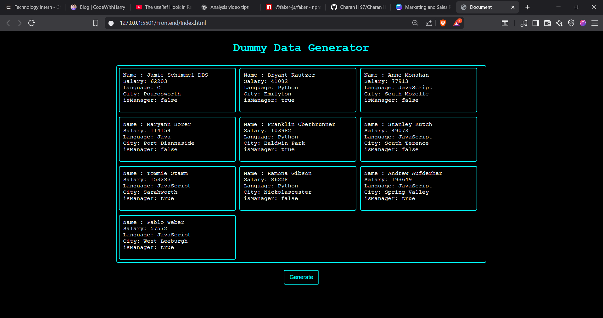

# Dummy Data Generator

- A simple web application to generate random employee data using Node.js, Express.js, Mongoose, Faker.js, and MongoDB Atlas.

- Whenever you click the Generate button, the backend:

- Deletes existing data from the MongoDB collection.

- Inserts 10 new randomly generated employee records.

- The frontend is hosted on GitHub Pages and fetches data from the backend hosted on Render.

## 🚀 Features

- One-click random employee data generation.

- Automatic deletion of old data before inserting new.

- Uses **Faker.js** for realistic dummy data.

- Data stored in **MongoDB Atlas cloud cluster**.

- Backend hosted on **Render**.

- Frontend hosted on **GitHub Pages**.


## 📖 Usage

1. Start the backend server (`node server.js`)
2. Open `docs/index.html` in a browser
3. Click the "Fetch Data" button:
    - The backend will check for the existing collection
    - If it exists, it will **drop** the collection 
    - If it doesn't exist, it will **create** the collection and insert the data of **10 random employee records**
4. The data will then be displayed on the webpage in a clean format

## Screenshot


## 🛠 Tech Stack
- Node.js

- Express.js

- Mongoose

- Faker.js

- MongoDB Atlas

- Render (Backend hosting)

- GitHub Pages (Frontend hosting)

## 📁 Project Structure
```bash
your-project/
├── backend/                 # Backend folder with server-side code 
|   |-- model/
|   |   |-- dataGenerator.js #js file to create a Mongoose Schema
│   ├── server.js              # Main backend server file
├── docs/                # docs folder with client-side code
│   ├── index.html           # Main HTML page
│   ├── script.js            # Frontend JavaScript code (handles button click, fetch data)
│   ├── style.css            # CSS file for styling the page
├── .env                     # Environment variables (e.g., MongoDB URI)
├── .gitignore               # Files/folders to exclude from Git (e.g., .env)
├── package.json             # Main project dependencies and scripts (if you have global ones)
├── README.md                # Project documentation
```

## 🔗 Live Links
- Frontend (GitHub Pages): https://charan1197.github.io/Dummy_Data_Generator/

- Backend (Render): https://dummy-data-generator-eqbt.onrender.com


## ⚡How It Works

- Open the frontend.

- Click on the Generate button.

- The backend deletes old data and inserts 10 new random employees.

- The frontend fetches and displays the latest data.

## 📦 Dependencies

Backend dependencies (installed using `npm install`):
- express
- mongoose
- dotenv
- faker
- cors

Frontend:
- Plain HTML, CSS, and JavaScript (no external libraries required)


## 📦 Installation

1. Clone the repo:
```bash
git clone https://github.com/Charan1197/Dummy_Data_Generator.git
cd DummyDataGenerator
```

2. Install dependencies:
```bash
npm install
```

3. Create a .env file:
```bash
MONGO_URI=your_mongodb_connection_string
```

4. Start the  server:
```bash
npm start
```

5. Frontend Setup

 - The frontend is plain HTML/JS and doesn’t need a build step.

- Open docs/index.html in a browser (or use GitHub Pages link).

- Make sure the backend URL inside your frontend code points to your local server (e.g., http://localhost:5000) or your Render-hosted backend.

## 🤝 Contributing

If you'd like to contribute, feel free to open a pull request with any improvements or features you'd like to add.